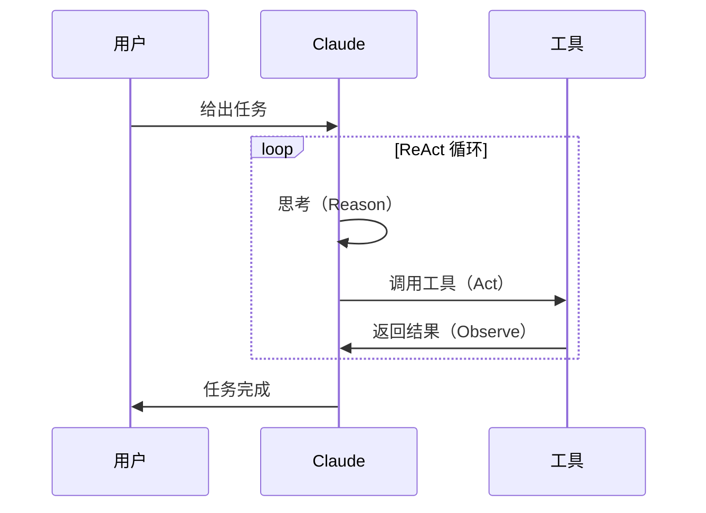

import DifficultyBadge from '@site/src/components/DifficultyBadge';

# 和普通 AI 聊天有什么不同？（Agent 思维模型）

<DifficultyBadge level="入门" />

## 聊天 vs Agent

普通聊天：你问 → AI 答 → 结束。

Agent 模式：你说目标 → AI 规划 → 调用工具 → 观察结果 → 继续推进 → 完成目标。

## ReAct 循环

Claude Code 使用的是经典 **ReAct（Reason + Act）** 循环：

import ArticleComplete from '@site/src/components/ArticleComplete';

<ArticleComplete />
